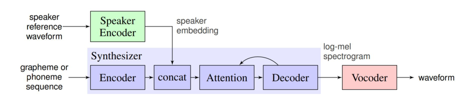
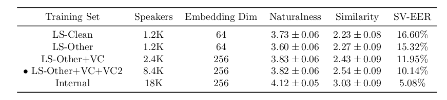
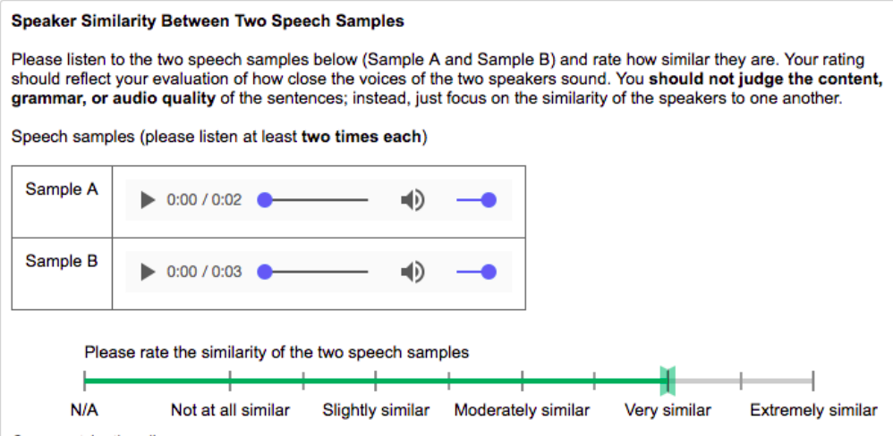

# Script of introducing video

## Giới thiệu nhóm

## Giới thiệu paper

[Paper with code][1]

## Voice cloning

_Nhân bản giọng nói (voice cloning)_ là việc tạo ra một mô phỏng nhân tạo giọng nói của một người. Các phần mềm AI nhân bản giọng nói ngày nay có khả năng tạo ra giọng nói tổng hợp gần giống với giọng nói của con người được nhắm mục tiêu. Trong một số trường hợp, người bình thường không thể nhận ra sự khác biệt giữa giọng thật và giọng giả.  
 
Theo các phương pháp truyền thống, để có thể nhân bản giọng nói của một đối tượng, ta phải cần tập dữ liệu huấn luyện lên đến hàng giờ ghi lại giọng nói của đối tượng đó.

## Giới thiệu bài toán:

- Input:
  - Đoạn ghi âm khoảng 5 giây của đối tượng
  - Đoạn văn bản muốn thực hiện TTS
- Output:
  - Đoạn âm thanh của văn bản sau khi thực hiện TTS với giọng nói của đối tượng đã được nhân bản

## Hướng tiếp cận

Hệ thống gồm có 3 thành phần (hình bên dưới):

- Speaker Encoder
- Synthesizer
- Vocoder

## Giới thiệu tổng quan các giai đoạn

### Speaker Encoder

_bộ mã hóa tiếng nói (speaker encoder)_ là mạng học sâu đã được huấn luyện với hàng ngàn đối tượng. Bộ mã hóa sẽ tạo ra vector nhúng (embedding), đây là biểu diễn tiếng nói một cách dễ hiểu đối với máy tính (Có thể xem như một bộ trích xuất đặc trưng). Nói cách khác, bộ mã hóa này cố gắng học được bản chất tiếng nói của con người qua dữ liệu giọng nói của hàng ngàn đối tượng.
 
Bảng bên dưới thể hiện kết quả huấn huyện trên các tập dữ liệu khác nhau. Bộ mã hóa lắng nghe giọng nói của hàng ngàn người, từ đó học sự phức tạp của tiếng nói con người. Bước huấn luyện này của cần thực hiện 1 lần, và sau đó ta chỉ cần đưa vào 5s ghi âm giọng nói của của một người nào đó (Không có trong tập dữ liệu huấn luyện). Bộ mã hóa sẽ tạo ra vector embedding và chuyển đến _bộ tổng hợp (synthesizer)_  

### Synthesizer

_Bộ tổng hợp (Synthesizer)_ nhận các đặc trưng mà bộ mã hóa tổng hợp được cùng với đoạn văn bản mà ta muốn tổng họp từ đó tạo ra biểu đồ Mel Spectrogram (biểu diễn ngắn gọn của giọng nói và ngữ điệu của một người nào đó). Việc triển khai mô đun này dựa trên kĩ thuật Tacotron của DeepMind.  
 
Hình bên dưới cho ta thấy Biểu đồ Mel Spectrogram giọng nói của của 3 đối tượng (bên trái) muốn nhân bản, và Mel Spectrogram của giọng đươc tổng hợp. Và cuối cùng ta cần chuyển Mel Spectrogram được tổng hợp thành âm thanh. Bộ tổng hợp sau đó đưa spectrogram đến _Bộ tổng hợp tiếng nói (vocoder)_

### Vocoder

_Bộ tổng hợp tiếng nói (vocoder)_ tổng hợp ra âm thanh ở dạng sóng từ 1 biểu đồ Mel Spectrogram. Vocoder được triển khai dựa trên kĩ thuật WaveNet của DeepMind

## Đánh giá

Để đánh giá đươc độ hiểu quả của hệ thống trên, theo nguyên tắc ta cần đáng giá độ tương đồng (similarity) của giọng nói nguốn với giọng nói được tổng hợp nhưng nói 2 câu nói hoàn toàn khác nhau. Ngoài ra ta còn phải đánh giá được độ tự nhiên (naturalness) của giọng nói đươc tổng hợp. Việc đánh giá này là 1 vấn đề khó khăn. Với các tập dữ liệu huấn luyện khác nhau, kết quả đánh giá có thể sẽ khác nhau.  
 
Hình dưới cho ta thấy 2 kết quả đánh giá độ hiệu quả của 2 tập dữ liệu khác nhau. Ban đầu ta dùng tập dữ liệu VCTK làm tập huấn luyện và LibriSpeech là tập kiểm thử. Sau đó đổi vai trò của 2 tập này. Có thể thấy được kết quả đánh giá có sự khác biệt đáng kể.
Để giải quyết vần đề này, tác giả sử dụng MOS (Mean Opion Score), sẽ có nhiều người đánh giá nghe đoạn âm thanh được tổng hợp và đánh giá độ tương đồng và độ tự nhiên trên thang đo từ 1 đến 5. Từ đó mà đánh giá mẫu âm thanh được chuyển thành giọng nói của con người tốt như thế nào.

## Demo

[1]: (https://paperswithcode.com/paper/generalized-end-to-end-loss-for-speaker)
